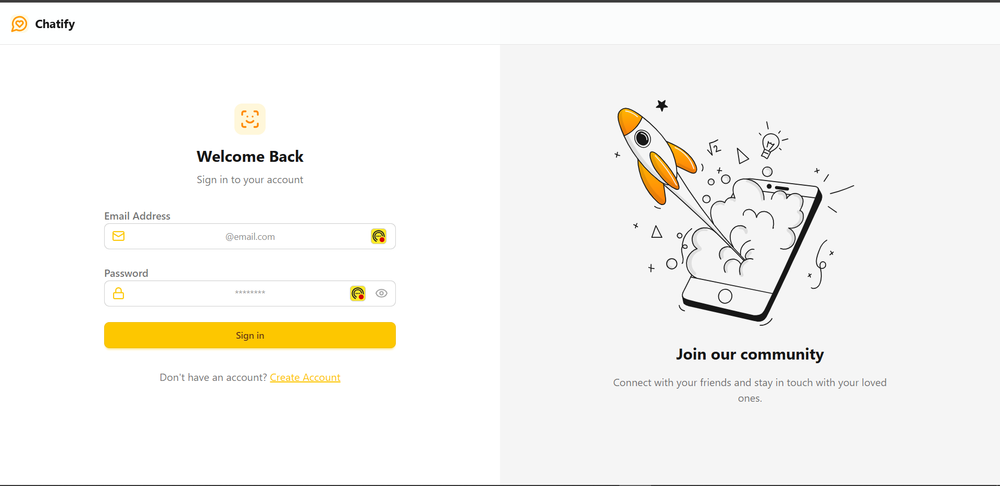
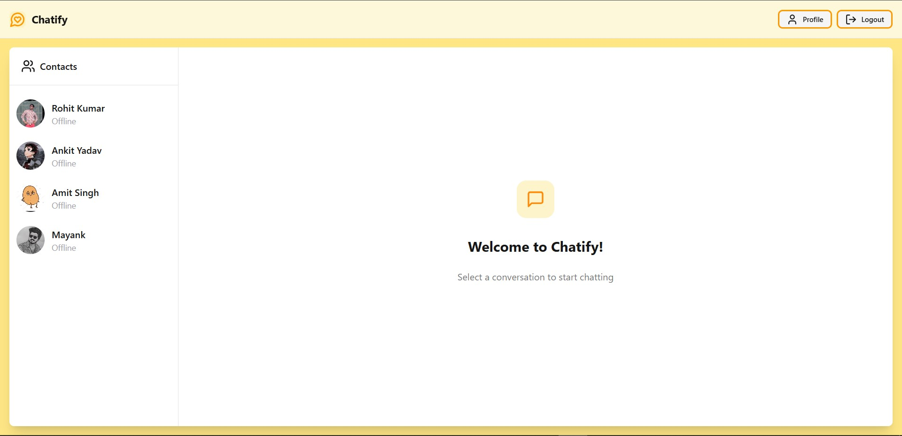

# ChatiFy

*Company*: CODETECH IT SOLUTIONS

*Name*: Rohit Kumar

*Intern ID*: CT12WC98

*Domain*: Mern Stack Web Development

*Duration*: 12 weeks

*Mentor*: Neela Santosh

ChatiFy is an innovative real-time chat application that combines a sleek React frontend with a robust Node.js backend to deliver an exceptional messaging experience. By utilizing modern technologies such as React, Vite, Socket.IO, and Express, ChatiFy ensures seamless communication between users. The application boasts several impressive features, including real-time messaging facilitated by Socket.IO and a responsive user interface styled with Tailwind CSS, making it visually appealing and user-friendly. Additionally, ChatiFy prioritizes security with JWT authentication, alongside integration with MongoDB for data management, ensuring that user information is both protected and easily accessible. Overall, ChatiFy exemplifies a forward-thinking approach to chat applications, providing users with both functionality and security.

## Features

- Real-time messaging using Socket.IO
- Responsive React frontend styled with Tailwind CSS
- Secure backend with JWT authentication and MongoDB integration

## Getting Started

### Prerequisites

- Node.js (version 18 or higher recommended)
- npm (comes with Node.js)

### Running the Frontend

1. Navigate to the `FrontEnd` directory:
   ```bash
   cd FrontEnd
   ```
2. Install dependencies:
   ```bash
   npm install
   ```
3. Start the development server:
   ```bash
   npm run dev
   ```
4. Open your browser and go to `http://localhost:5173` (or the URL shown in the terminal).

### Running the Backend

1. Navigate to the `BackEnd` directory:
   ```bash
   cd BackEnd
   ```
2. Install dependencies:
   ```bash
   npm install
   ```
3. Start the backend server:
   ```bash
   npm run dev
   ```
4. The backend server will start on the port specified in your `.env` file (default is usually 3000).

## Included Images

- 
- 

-----

Made by Rohit 🐱‍🏍


